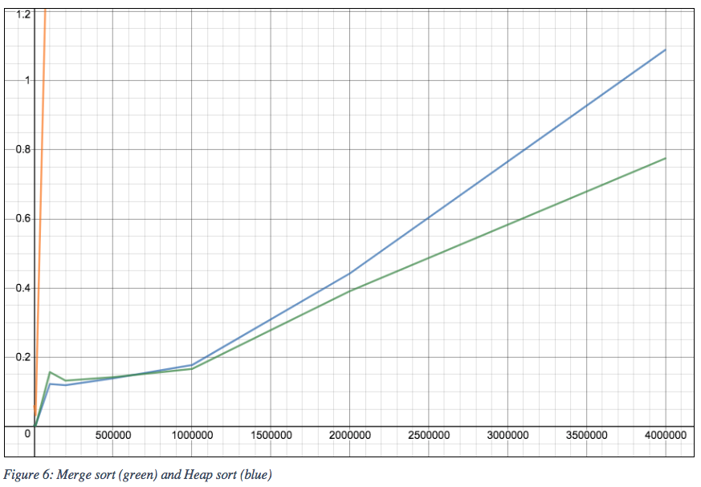
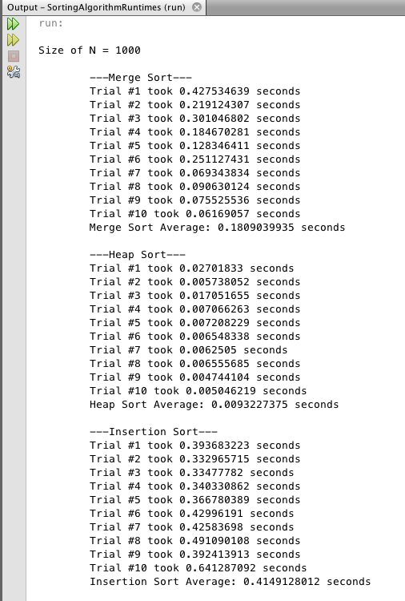

# SortingAlgorithmRuntimes
The focus of this project is to establish, analyze, and compare the actual running times of four sorting algorithms with their theoretical running times. Code contribution references are in the java class comments and also in the report. Read the full report here: (https://github.com/jeliceiri/SortingAlgorithmRuntimes/blob/master/docs/BigO-Sorting.pdf).

* The four sorting algorithms include: heap sort, merge sort, insertion sort, and selection sort.

 

Read the full report here: (https://github.com/jeliceiri/SortingAlgorithmRuntimes/blob/master/docs/BigO-Sorting.pdf). 

